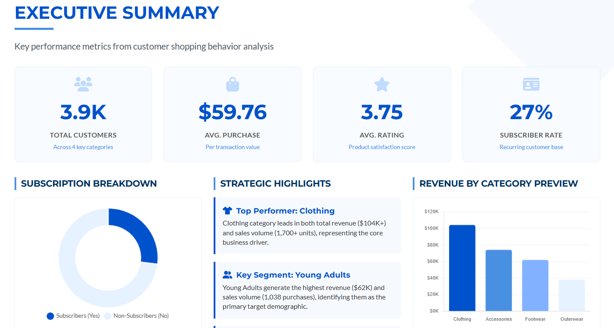
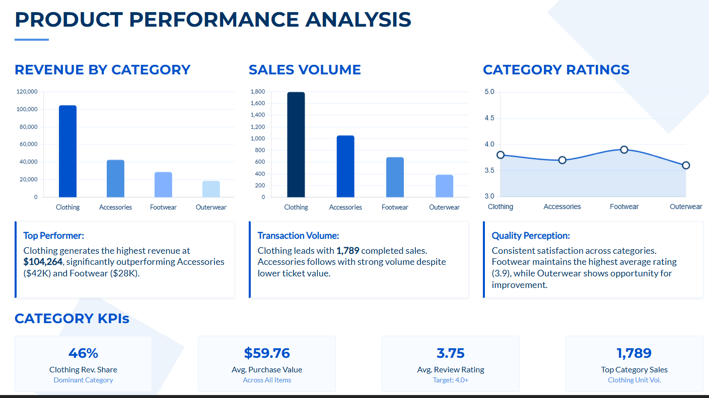
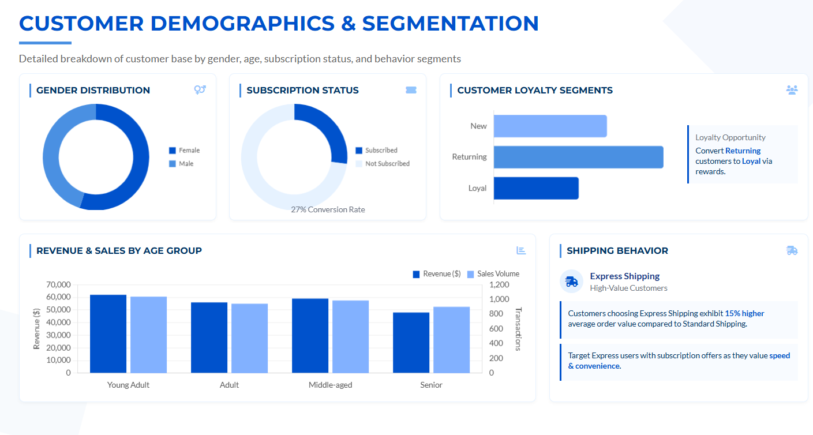

# Customer Shopping Behavior Analysis

This project is a **complete, real‑world style data analytics case study** where I explored how customers behave while shopping on an e‑commerce platform. I didn’t jump straight into a dashboard — instead, I followed the same **step‑by‑step workflow that professional data analysts use in industry**.

The journey starts with raw data, moves through Python analysis, connects to a SQL database, answers business questions using SQL, and finally tells a clear story through an interactive Power BI dashboard.

Think of this project as how insights would actually be delivered inside a company — not just charts, but **meaningful business understanding**.

[Live Project Demo](https://nachiket111.github.io/Customer-Shopping-Behavior-Analysis/)

---

## Why This Project Matters

Businesses don’t care about data for the sake of it — they care about **customer behavior**:

* Who is buying?
* What are they buying?
* How much are they spending?
* Which customers matter the most?

This project answers those questions in a clean, visual, and decision‑focused way.

---

## Tools & Technologies Used

### Programming & Analysis

* **Python** (pandas, numpy, matplotlib, seaborn)  – data cleaning, preprocessing, and exploration
* **Jupyter Notebook** – step‑by‑step analysis documentation
* **MySQL** – storing cleaned data and answering business questions using SQL
* **Power BI** – building an interactive dashboard for stakeholders

---

## Understanding the Dataset

The dataset represents **customer shopping transactions**. Each row corresponds to one customer purchase and includes:

* Customer details (gender, age group)
* Product category
* Purchase amount
* Subscription status
* Shipping type
* Customer review rating

In simple terms, this is the kind of data an e‑commerce company works with every day.

---

## End‑to‑End Project Workflow

### Step 1️: Data Loading & Initial Checks (Python)

I began by loading the raw CSV data into Python using pandas. Before analyzing anything, I:

* Checked the size and structure of the dataset
* Reviewed column names and data types
* Looked for missing or inconsistent values

 *Purpose:* Understand the data before making any assumptions.

---

### Step 2️: Data Cleaning & Preparation

Real‑world data is never clean. In this step, I:

* Handled missing values
* Standardized category names
* Corrected data types
* Created useful derived columns such as **Age Groups**

 *Purpose:* Ensure the data is reliable and analysis‑ready.

---

### Step 3️: Exploratory Data Analysis (EDA)

Once the data was clean, I explored it to uncover patterns and trends:

* Customer distribution across product categories
* Spending behavior by age group
* Differences between subscribed and non‑subscribed users

 *Purpose:* Understand customer behavior before asking SQL‑level business questions.

---

### Step 4️: Connecting Python to SQL

After cleaning the data in Python, I:

* Connected Python to a MySQL database using code
* Loaded the cleaned dataset into SQL tables
* Validated row counts and data integrity

 *Why this matters:* This simulates how data analysts work with production databases in real companies.

---

### Step 5️: SQL Business Analysis

Using SQL, I answered practical business questions such as:

* Which product categories generate the most revenue?
* Which age groups contribute the most sales?
* How do subscribers compare with non‑subscribers?
* What is the average purchase amount?

 *Purpose:* Extract insights directly from structured database queries.

---

### Step 6️: Power BI Dashboard Development

Finally, I created an **interactive Customer Behavior Dashboard** in Power BI.

#### Dashboard Features

* KPI cards showing:

  * Total customers
  * Average purchase amount
  * Average review rating

* Visual analysis of:

  * Revenue by category
  * Sales by category
  * Revenue by age group
  * Sales by age group

---

## Key Insights & Expert Observations

### 1. Subscription Adoption Is Low

* Around **73% of customers are non‑subscribers**
* Only **27% are subscribed**

 *Insight:* There is strong potential to grow recurring revenue.

 **Recommendation:** Improve subscription benefits such as exclusive discounts or free shipping.

---

### 2. Clothing Is the Strongest Category

* Clothing leads in both **revenue and number of sales**

 *Insight:* The business heavily depends on one category.

 **Recommendation:** Encourage cross‑selling with accessories and footwear.

---

### 3. Young Adults Drive the Business

* Young Adults generate the **highest revenue and sales volume**

 *Insight:* This segment is the most valuable.

**Recommendation:** Focus marketing campaigns and personalization on this age group.

---

### 4. Customer Satisfaction Is Average

* The average review rating is **3.75**

 *Insight:* Customers are neutral — not unhappy, but not delighted.

**Recommendation:** Improve delivery experience, product quality, and post‑purchase engagement.

---

## Final Conclusion

This project demonstrates my ability to:

* Work with raw data
* Clean and analyze it using Python
* Query insights using SQL
* Build professional dashboards in Power BI
* Communicate insights clearly and logically

This reflects how a **real data analyst thinks and works**, not just how tools are used.

Author: Nachiket Patil
